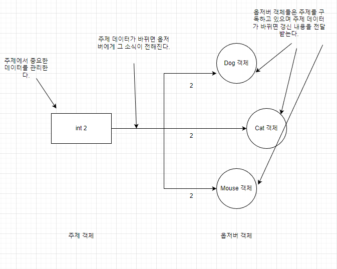

# 옵저버 패턴
옵저버(Observer Pattern)은 한 객체의 상태가 바뀌면 그 객체에 의존하는 다른 객체에게 연락이 가고 자동으로 내용이 갱신되는 방식으로 일대다(1:N) 의존성을 정의한다.

## 옵저버 패턴의 이해
옵저버 패턴에서는 Subject(주체)와 Observer(관찰자) 두 가지 역할이 있다. Subject는 상태가 변화할 때 알리는 역할을 하고 Observer는 상태를 감시하고 있으며 변화가 있을 경우 이에 대한 처리를 하는 역할을 한다.
<br/><br/>
Subject는 Observer 객체들을 등록하고 삭제할 수 있는 인터페이스를 제공한다. Observer는 Subject에서 제공하는 인터페이스를 구현하고, Subject 객체에서 등록/삭제를 할 수 있다. 등록된 옵저버들은 Subject가 보내는 데이터를 수신 받을 수 있다.

<br/><br/>
### Subject
```java
// Subject 인터페이스
public interface Subject {
	public void registerObserver(Observer o);
	public void removeObserver(Observer o);
	public void notifyObservers();
}
```
```java
// Subject 구현체
public class WeatherData implements Subject { // Subject 인터페이스를 구현한다.
	private List<Observer> observers; // Observer의 객체들을 저장하는 ArrayList를 추가한다.
	private float temperature;
	private float humidity;
	private float pressure;
	
	public WeatherData() {
		observers = new ArrayList<Observer>();
	}
	
    // 옵저버 등록
	public void registerObserver(Observer o) {
		observers.add(o);
	}

    // 옵저버 삭제
	public void removeObserver(Observer o) {
		observers.remove(o);
	}
	
    // 등록된 옵저버에게 데이터를 전달해준다.
	public void notifyObservers() {
		for (Observer observer : observers) {
			observer.update(temperature, humidity, pressure);
		}
	}
	
    // setter를 통해 값이 변경되면 notifyObservers 메서드를 실행
	public void setMeasurements(float temperature, float humidity, float pressure) {
		this.temperature = temperature;
		this.humidity = humidity;
		this.pressure = pressure;
        notifyObservers();
	}
}

```
### Observer
```java
// Observer인터페이스
public interface Observer {
    public void update(float temp, float humidity, float pressure);
}

// DisplayElement 인터페이스
public interface DisplayElement {
    public void display();
}
```
```java
// Observer, DisplayElement 구현체
public class CurrentConditionsDisplay implements Observer, DisplayElement { // Opserver, DisplayElement 인터페이스 상속
    private float temperature;
    private float humidity;
    private WeatherData weatherData;

    // 생성자에 WeatherData 주제가 전달되며 객체를 받아 자기 자신을 옵저버로 등록해준다.
    public CurrentConditionsDisplay(WeatherData weatherData) {
        this.weatherData = weatherData;
        weatherData.registerObserver(this);
    }

    // update() 메서드가 호출되면 데이터를 저장하고 display() 메서드를 호출한다.
    public void update(float temperature, float humidity, float pressure) {
        this.temperature = temperature;
        this.humidity = humidity;
        display();
    }

    public void display() {
        System.out.println("현재 상태: 온도" + temperature
                + "F, 습도 " + humidity + "%");
    }
}

```
## Subject가 push하는게 아닌 Observer가 pull하는 방식으로 바꾸기
위에서 설명한 옵저버패턴은 하나의 데이터만 갱신해도 되는 상황에서도 update() 메서드를 실행하면 모든 데이터를 보내도록 되어있다.
지금은 상관 없지만 나중에 다른 데이터가 추가 되었을때 문제가 발생한다. update() 메서드에서 추가된 데이터를 사용하지 않아도
모든 디스플레이에 있는 update() 메서드를 바꿔야 하기 때문이다.
```java
// 1. 옵저버의 update() 메서드를 인자없이 호출하도록 notifyObservers() 메서드를 수정한다.
public class WeatherData implements Subject { 
    private List<Observer> observers; 
    private float temperature;
    private float humidity;
    private float pressure;

    public WeatherData() {
        observers = new ArrayList<Observer>();
    }
    
    public void registerObserver(Observer o) {
        observers.add(o);
    }

    public void removeObserver(Observer o) {
        observers.remove(o);
    }

    // 인자를 제거
    public void notifyObservers() {
        for (Observer observer : observers) {
            observer.update();
        }
    }
    
    public void setMeasurements(float temperature, float humidity, float pressure) {
        this.temperature = temperature;
        this.humidity = humidity;
        this.pressure = pressure;
        notifyObservers();
    }
}

// 2. 옵저버의 update 메서드를 인자 없이 호출하도록 메서드를 호출한다.
public interface Observer {
    public void update();
}

// 3. 데이터는 weatherData의 getter 메서드로 데이터를 가져오게 변경한다.
public class CurrentConditionsDisplay implements Observer, DisplayElement { // Opserver, DisplayElement 인터페이스 상속
    private float temperature;
    private float humidity;
    private WeatherData weatherData;


    public CurrentConditionsDisplay(WeatherData weatherData) {
        this.weatherData = weatherData;
        weatherData.registerObserver(this);
    }

    // 필요한 데이터만 getter로 받아서 데이터를 변경시켜준다.
    public void update() {
        this.temperature = weatherData.getTemperature();
        this.humidity = weatherData.getHumidity();
        display();
    }

    public void display() {
        System.out.println("현재 상태: 온도" + temperature
                + "F, 습도 " + humidity + "%");
    }
}

```


## 옵저버 패턴을 사용하는 상황
옵저버 패턴은 주로 다음과 같은 상황에서 사용됩니다.

- 하나의 객체의 상태 변경에 따라 다른 객체들에게 알리고자 할 때
- 상태 변경에 대한 행동을 일괄적으로 취해야 할 때
- 상호작용하는 여러 객체들 중 하나의 객체의 상태를 다른 객체들이 감시하고자 할 때
